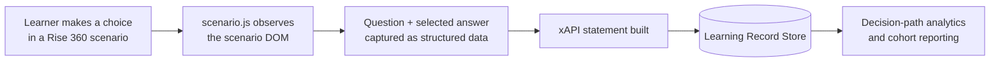

# Scenario Choice Handler

Capture learner choices from Articulate Rise 360 scenarios and send structured xAPI-style data to your Learning Record Store.

[![MIT License][license-shield]][license-url]
[![Stargazers][stars-shield]][stars-url]
[![Issues][issues-shield]][issues-url]

---

## I. Overview

Most learning tools track completion. Completion tells you that someone finished — not what they decided, where they hesitated, or which misconceptions showed up along the way.

Scenario-based learning is built on decisions, but Rise 360 doesn't expose scenario choices as data. This project fixes that: a lightweight JavaScript file you drop into an exported Rise course that captures every scenario question and the answer the learner selected, then sends it to your LRS as an xAPI statement.

## II. Why This Exists

Rise 360 scenario blocks are one of the best ways to build decision practice into a course, but the choices learners make inside them are invisible to standard reporting. If you want to know *how* a cohort thinks — not just whether they clicked through — you need the decision-path data.

I built this because I needed it: I wanted to see which options learners actually chose in the scenarios I shipped, and Articulate doesn't provide that functionality. This is the missing telemetry layer.

## III. How It Works



1. Export your Rise 360 course.
2. Add `scenario.js` to the exported course's `lib` folder.
3. The script watches the scenario blocks, grabs each question and the learner's selected answer, and sends an xAPI statement to the LRS configured for the course.
4. Analyze the statements in your LRS — by learner, by cohort, by question.

## IV. Sample Statement

A captured choice looks like this in your LRS:

```json
{
  "actor": {
    "name": "Jordan Learner",
    "mbox": "mailto:jordan@example.com"
  },
  "verb": {
    "id": "http://adlnet.gov/expapi/verbs/responded",
    "display": { "en-US": "responded" }
  },
  "object": {
    "id": "https://example.com/courses/faker/scenario/1/question/2",
    "definition": {
      "name": { "en-US": "A colleague asks you to share your login credentials. What do you do?" },
      "type": "http://adlnet.gov/expapi/activities/cmi.interaction",
      "interactionType": "choice"
    }
  },
  "result": {
    "response": "Decline and point them to the access request process"
  },
  "timestamp": "2026-07-04T18:30:00Z"
}
```

## V. Use Cases

- **Scenario-based learning analytics** — see the choices behind the completion number.
- **Decision-path analysis** — which routes do learners take through branching scenarios, and where do they stall?
- **Cohort misconception patterns** — when 40% of a cohort picks the same wrong answer, that's a design signal, not a learner problem.
- **xAPI / LRS experimentation** — a small, readable starting point for anyone learning how xAPI statements are built and sent.

## VI. Setup

1. Export your Rise 360 course (LMS/xAPI export).
2. Copy [`scenario.js`](faker/lib/scenario.js) from the [`faker/lib`](faker/lib) folder into your exported course's `lib` folder.
3. Add this line to your course's `index.html`:

   ```html
   <script type="text/javascript" src="lib/scenario.js"></script>
   ```

4. Zip the course and upload it to your LRS or LMS as usual.

A complete sample course, [**Faker**](faker), is included. If you use an LRS such as [SCORM Cloud](https://scorm.com/), download the Faker folder, zip it, and upload it to see the statements flow end to end.

## VII. Roadmap

- [ ] Cleaner configuration (LRS endpoint and auth in one config block)
- [ ] Expanded xAPI payload examples for common scenario shapes
- [ ] LRS integration notes (SCORM Cloud, Learning Locker, Veracity)
- [ ] Step-by-step Rise 360 implementation guide with screenshots

## VIII. Contributing

Issues and pull requests welcome — especially real-world Rise 360 edge cases the script doesn't handle yet.

## IX. License

Distributed under the MIT License. See `LICENSE.txt` for details.

## X. Contact

Chris Richardson — [chrisrichardson.dev](https://chrisrichardson.dev) · [LinkedIn](https://linkedin.com/in/richardsonchrisj)

<!-- MARKDOWN LINKS -->

[license-shield]: https://img.shields.io/github/license/richardsonchrisj/ScenarioChoiceHandler.svg?style=for-the-badge
[license-url]: https://github.com/richardsonchrisj/ScenarioChoiceHandler/blob/master/LICENSE.txt
[stars-shield]: https://img.shields.io/github/stars/richardsonchrisj/ScenarioChoiceHandler.svg?style=for-the-badge
[stars-url]: https://github.com/richardsonchrisj/ScenarioChoiceHandler/stargazers
[issues-shield]: https://img.shields.io/github/issues/richardsonchrisj/ScenarioChoiceHandler.svg?style=for-the-badge
[issues-url]: https://github.com/richardsonchrisj/Scena